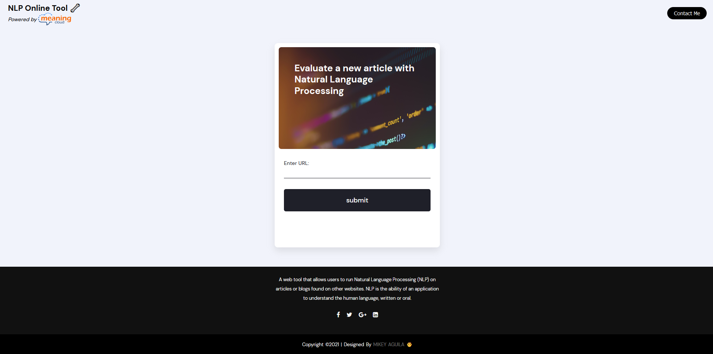
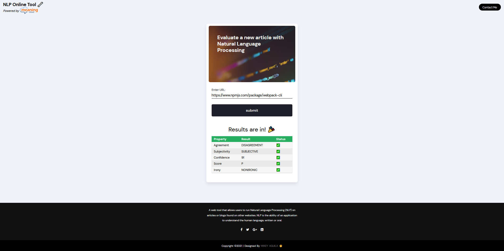

# Evaluate a news article with Natural Language Processing Project

This repository creates a little client-server-side web application that can send text snipets to the MeaningCloud Sentiment Analysis API and display the results. It's a great starting point if you are interested in learning about
- Setting up Webpack
- Sass styles
- Webpack Loaders and Plugins
- Creating layouts and page design
- Service workers
- Using APIs and creating requests to external urls
- Basic Natural Language Processing

Initial Page             
:-------------------------:

<!--  -->
Results             
:-------------------------:

## Installation instructions
In the terminal run:
- `git clone https://github.com/mikeyaguila/evaluate-news-nlp.git`
- `cd evaluate-news-nlp`
- Run `npm install` to install all dependencies listed in `package.json`. Among them are e.g., webpack, babel, node-sass, and jest (and some more). Checkout the file if you are interested.

## Get API Credentials for Meaningcloud
- Go to [meaningcloud.com](https://www.meaningcloud.com/developer/sentiment-analysis) and create an account. It is free to check how many requests you have remaining for the day.
- Create a file called `.env` in the root `evaluate-news-nlp` folder and paste this line inside the file `API_KEY=xxxxx<API_KEY>xxxxxx` and put your API key here.

## Running the App (Production Mode)
- Run `npm run build-prod`. This should finish without an error.
- Run `npm run start`
- Go to [http://localhost:8081/](http://localhost:8081/) in your browser (e.g. Firefox, Google Chrome). By default, this app runs on port 8081, but you can edit that in `src/server/index.js`.
- Wait a second and see the results displayed in the website.

## Running the App (Developer Mode)
- Open another terminal tab ad run `npm run build-dev`. Now, Chrome should open a tab then automatically navigate to http://localhost:8080/.

## Testing the App With Jest
If you want to check out the basic Jest unit tests in the repository then
- Run `npm run test` or `npm test` in the terminal and look at the test information displayed.

## Extend This Project
- Deploying the project e.g., on [Netlify](https://www.netlify.com/) or [Heroku](https://www.heroku.com/) should be fun.
- You could display more information received from the MeaningCloud API call.

## Acknowledgements
This project focuses on Udacity's Front End Web development Nanodegree.
